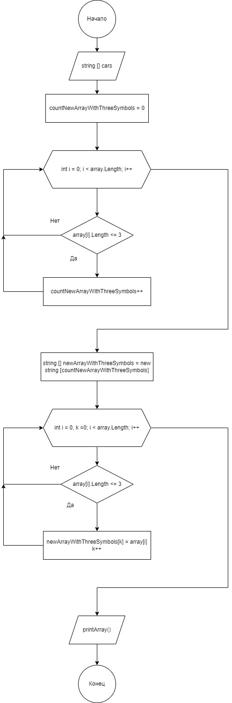

# Описание программы

### Программа, которая из имеющегося массива строк формирует массив из строк, длина которых меньше либо равна 3 символа. Первоначально массив можно ввести с клавиатуры, либо задать на старте выполнения алгоритма.

;
